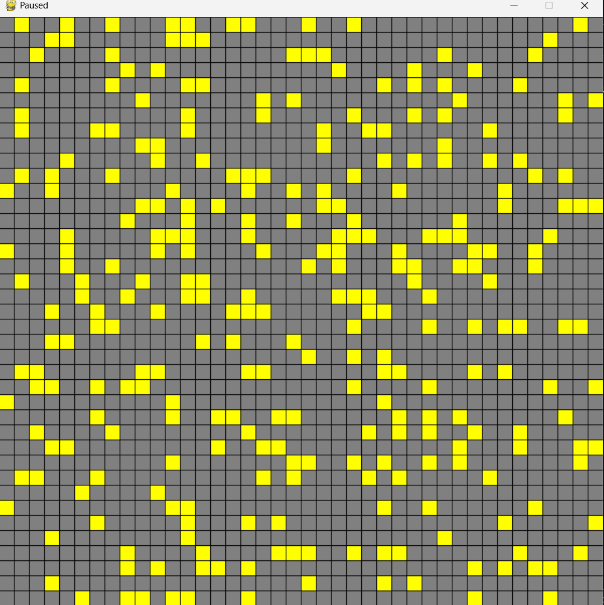
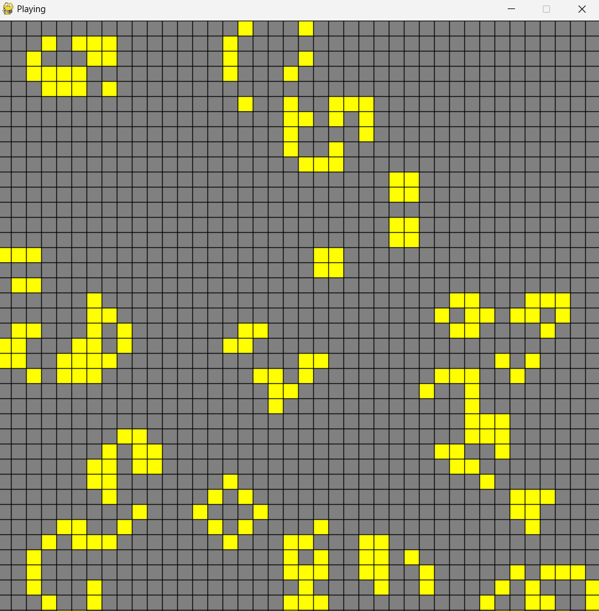

# Conway's Game of Life

## Overview

This project is a Python implementation of Conway's Game of Life using Pygame. Conway's Game of Life is a cellular automaton devised by mathematician John Horton Conway. The game is a zero-player game, meaning that its evolution is determined by its initial state, requiring no further input.

## Features
- Interactive grid where you can toggle cells on and off by clicking.
- Start and stop the simulation with the spacebar.
- Clear the grid and stop the simulation with the 'C' key.
- Generate a random initial configuration with the 'G' key.
- Adjustable update frequency for the simulation speed.

## Requirements

- Python 3.x
- Pygame library

## Installation

1. Clone the repository:
    ```sh
    git clone https://github.com/piyushd12/conways-game-of-life.git
    cd conways-game-of-life
    ```

2. Create a virtual environment (optional but recommended):
    ```sh
    python -m venv venv
    source venv/bin/activate  # On Windows, use `venv\Scripts\activate`
    ```

3. Install the required packages:
    ```sh
    pip install pygame
    ```

## Usage
Run the `conway's-game-of-life` file to start the application:
```sh
python conway's-game-of-life.py
```

## Controls

- **Mouse Click:** Toggle cells on and off.
- **Spacebar:** Start/stop the simulation.
- **C Key:** Clear the grid and stop the simulation.
- **G Key:** Generate a random initial configuration.

## Functions

- **gen(num):** Generates a set of random initial positions.
- **draw_grid(positions):** Draws the grid and the current state of cells.
- **adjust_grid(positions):** Adjusts the grid according to the rules of the Game of Life.
- **get_neighbors(pos):** Returns the neighbors of a given cell.

## Screenshots

<br>
   <p>Initial Population</p>
   
<br>
   <p>Simulation Running</p>

**License**

This project is licensed under the MIT License - see the [LICENSE](LICENSE) file for details.
